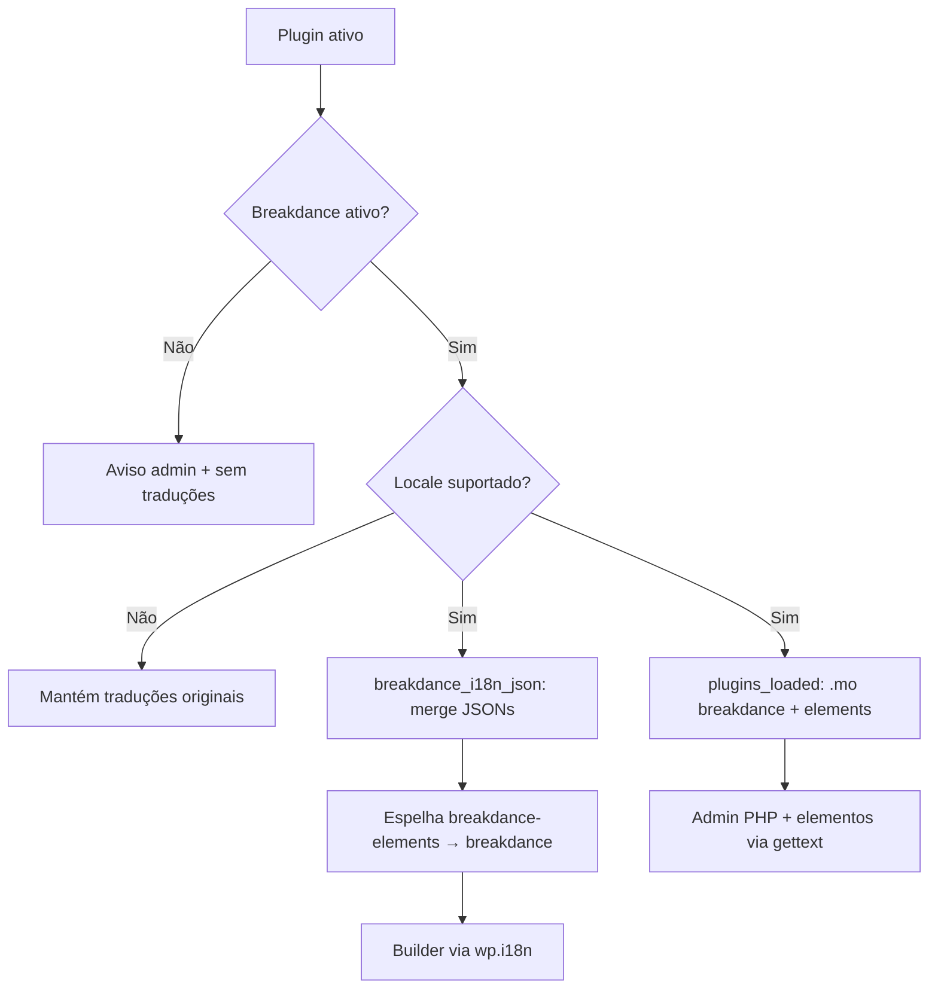

# Breakdance Languages — Avaliação Técnica

**Data:** 2026-06-26 (reavaliação)  
**Versão analisada:** `ux-0.1.0`  
**Breakdance detectado no ambiente:** `2.8.0`

---

## Resumo

Plugin complementar da **UX Widget** que adiciona pacotes de idioma ao **Breakdance Builder** sem alterar o core. Produto independente, não afiliado à equipe Breakdance.

Desde a primeira avaliação, o plugin evoluiu de um loader simples (~140 linhas) para uma implementação mais madura (~225 linhas), com guarda de dependência, merge de JSON de elementos e ferramentas de release.

**Veredito atual:** arquitetura sólida e pronta para beta comercial controlado. O QA automático de placeholders em `pt_BR`/`pt_PT` passa, mas ainda é recomendável revisão humana de copy antes de campanha pública.

---

## O que faz

| Camada | Mecanismo | Arquivos |
|--------|-----------|----------|
| **Admin / PHP** | `load_textdomain()` em `plugins_loaded` | `breakdance-{locale}.mo`, `breakdance-elements-{locale}.mo` |
| **Builder (JS)** | Filtro `breakdance_i18n_json` (prioridade 20) | `breakdance-{locale}.json` + `breakdance-elements-{locale}.json` |
| **Controles dos elementos** | Breakdance traduz em runtime via `_x()` + gettext | `.mo` de `breakdance-elements` |
| **Compatibilidade JS** | Espelhamento `breakdance-elements` → `breakdance` | Necessário porque o loader do Breakdance registra tudo no domínio fixo `breakdance` |

### Idiomas incluídos

`pt_BR`, `pt_PT`, `fr_FR`, `de_DE`, `es_ES`, `ar`, `ja_JP`, `it_IT`, `en_GB`, `en_US`

O locale segue `get_user_locale()`, igual ao Breakdance. O japonês (`ja_JP`) está implementado nos catálogos `.po`/`.json`/`.mo` e no painel de configurações.

---

## Mudanças desde a avaliação anterior

| Item | Antes | Agora |
|------|-------|-------|
| Checagem de dependência | Ausente | `breakdance_languages_is_breakdance_active()` via constantes `__BREAKDANCE_*` |
| Aviso no admin | Ausente | `admin_notices` quando Breakdance não está ativo |
| JSON de elementos | Órfãos (não carregados) | Merge ativo + espelhamento para domínio `breakdance` |
| QA de placeholders | Manual | `scripts/qa-placeholders.py` |
| Pacote de distribuição | Sem regras | `.distignore` exclui cache, scripts e marketing |
| Changelog | Básico | Documenta as melhorias acima |
| en_US | Ausente | Arquivos próprios gerados a partir de `en_GB` |
| Fallbacks | Vazio | `translation-fallbacks.json` implementa `en_US` → `en_GB` |
| Painel admin | Ausente | `Settings > Breakdance Languages` com diagnóstico |
| Freemius | Ausente | Scaffold seguro, ativado apenas com SDK e constantes |

---

## Integração com o Breakdance

### Builder (JavaScript)

O Breakdance carrega JSON em `loadI18nScripts()` e aplica o filtro `breakdance_i18n_json` antes de `wp.i18n.setLocaleData()`. O loader usa **sempre** o domínio hardcoded `"breakdance"`:

```171:177:wp-content/plugins/breakdance/plugin/loader/loader-utils.php
      ( function( domain, translations ) {
          if (!translations?.locale_data) return;
          var localeData = translations.locale_data[ domain ] || translations.locale_data.messages;
          localeData[""].domain = domain;
          wp.i18n.setLocaleData( localeData, domain );
      } )( "breakdance", {$json} );
```

A função `breakdance_languages_merge_jed_domain_into_domain()` resolve isso copiando traduções de `breakdance-elements` para `breakdance`. Decisão correta e bem documentada no código.

### Admin / PHP

O Breakdance carrega o text domain `breakdance` em `plugins_loaded` via `load_plugin_textdomain()`. Este plugin sobrepõe com `load_textdomain()` apontando para os `.mo` próprios. Para locales ausentes no Breakdance (ex.: `pt_BR`), funciona como esperado.

### Elementos

Controles e nomes de elementos usam `_x()` em `breakdance/plugin/i18n/elements.php`, dependendo dos `.mo` de `breakdance-elements`. O JSON espelhado cobre strings que passam pelo `wp.i18n` no builder.

---

## Estrutura do repositório

```
breakdance-languages/
├── breakdance-languages.php    # Único código executável (~225 linhas)
├── languages/                  # 16 .mo, 24 .po, 16 .json
├── scripts/qa-placeholders.py  # QA de espaçamento em placeholders
├── .distignore                 # Exclusões do ZIP comercial
├── translation-cache.json      # Artefato de build — excluído do ZIP, não usado em runtime
├── translation-fallbacks.json  # Fallbacks de locale usados em runtime
├── docs/
└── marketing/
```

### Inventário de assets (por locale)

| Tipo | Quantidade | Observação |
|------|------------|------------|
| `.mo` (breakdance + elements) | 16 | Presentes para os 8 locales |
| `.json` builder | 8 | ~1.280 chaves cada |
| `.json` elements | 8 | ~2.219 chaves cada |
| `.po` builder (fonte) | 8 | Usados para gerar JSON, não carregados em runtime |

---

## Fluxo de carregamento (atualizado)



---

## Pontos fortes

1. **Arquitetura correta** — filtro oficial, gettext nativo, sem alterar core.
2. **Guarda de dependência** — não carrega traduções sem Breakdance; aviso claro no admin.
3. **Compatibilidade JS bem resolvida** — espelhamento de domínio para o loader hardcoded do Breakdance.
4. **Cobertura ampla** — catálogos completos para 9 idiomas traduzidos (`pt_BR`, `pt_PT`, `fr_FR`, `de_DE`, `es_ES`, `ar`, `ja_JP`, `it_IT`) + `en_US` baseline em 3 camadas (admin, builder, elements).
5. **Pipeline de release iniciado** — `.distignore` + script de QA.
6. **Segurança adequada** — `ABSPATH`, whitelist de locale, paths controlados, `esc_html__` no aviso, capability `activate_plugins`.
7. **Documentação comercial e técnica** preparada para venda.

---

## Lacunas e riscos

| Item | Severidade | Detalhe |
|------|------------|---------|
| **Licenciamento Freemius sem credenciais reais** | Média | Scaffold existe, mas o build comercial ainda precisa de SDK, product ID e public key |
| **Revisão humana de copy PT** | Média | QA técnico de placeholders passa; ainda convém revisão editorial antes de campanha pública |
| **Strings hardcoded** | Conhecido | JS compilado, WooCommerce, conteúdo — documentado em `COMPATIBILITY.md` |
| **Versão `ux-0.1.0`** | Baixa | Pré-lançamento; naming não segue semver puro |

---

## QA de qualidade das traduções

Scripts:

```bash
python scripts/qa-placeholders.py --summary --all-supported
python scripts/fix-placeholder-spacing.py --locale fr_FR --locale de_DE  # após MT
```

### Resultado (2026-07-09, pós-correção automática)

| Locale | Suspeitas | Notas |
|--------|-----------|-------|
| `pt_BR` | **0** | Gate de release |
| `pt_PT` | **0** | Gate de release |
| `fr_FR` | 26 | MT residual (HTML/pontuação) |
| `de_DE` | 90 | MT cola verbos compostos (`%sfest`, `%shinzu`) |
| `es_ES` | 10 | Residual baixo |
| `ar` | 37 | Residual RTL / pontuação |
| `ja_JP` | 61 | Muitos falsos positivos (sem espaços entre palavras) |
| `it_IT` | **0** | Catálogos completos; QA técnico OK |
| `en_US` / `en_GB` | 2 cada | Falsos positivos do baseline |

**Veredito de arquitetura (9 idiomas + baseline):** aprovado — `.po`, `.mo` e `.json` existem nas 3 camadas.

**Risco atual:** qualidade de copy MT (especialmente `de_DE`), não estrutura. Casos críticos `%sPro`, `%1$s` colado em HTML e `de%sa%s` foram corrigidos em massa via `fix-placeholder-spacing.py` (791 entradas).

O scanner ignora falsos positivos conhecidos (`%spx`, URLs, placeholders intencionalmente compactos no `msgid` fonte).

---

## Estado atual: pronto para quê?

| Uso | Status |
|-----|--------|
| **Teste local com pt_BR** | Funcional — `.mo`, `.json` e merge de elementos ativos |
| **Uso interno / agency beta** | Viável com ressalva de qualidade PT |
| **Venda comercial** | Viável após inserir credenciais/SDK Freemius no build comercial |
| **WordPress.org (free)** | Possível como language pack; excluir marketing e cache via `.distignore` |

---

## Relação com o UX Widget

Mesmo autor (`UX Widget`), domínio `uxwidget.com`, mas **produto separado** do plugin UX Widget. Sem integração de código.

---

## Próximos passos sugeridos (prioridade)

1. **Criar produto Freemius** — inserir SDK, product ID e public key no build comercial.
2. **Revisão editorial PT** — além do QA técnico, revisar termos principais da interface.
3. **Testar painel admin** — validar diagnóstico em site limpo com Breakdance ativo/inativo.
4. **Empacotar release** — respeitando `.distignore`.

---

## Referências internas

- Código: `breakdance-languages.php`
- QA: `scripts/qa-placeholders.py`
- Distribuição: `.distignore`
- Filtro Breakdance: `breakdance/plugin/loader/loader-utils.php`
- Elementos: `breakdance/plugin/i18n/elements.php`
- Docs: `docs/INSTALLATION.md`, `docs/COMPATIBILITY.md`, `docs/CHANGELOG.md`

---

## Atualização pós-reavaliação

Resolvido após a reavaliação:

- README atualizado para documentar dependência do Breakdance, merge de JSON de elementos e prioridade de carregamento.
- Header `Requires Plugins: breakdance` adicionado.
- Carregamento gettext alterado para `plugins_loaded` prioridade 20.

Ainda pendente:

- Credenciais reais e SDK Freemius no build comercial.
- Revisão editorial humana das traduções PT.
- Teste funcional do painel admin em site limpo.

---

## Atualização de produto

Resolvido na sequência:

- 408 placeholders suspeitos em `pt_BR`/`pt_PT` corrigidos ou classificados como falso positivo no scanner.
- QA de placeholders `pt_*` passa sem ocorrências.
- Locale `en_US` criado com arquivos `.po`, `.mo` e `.json`.
- `translation-fallbacks.json` implementado com `en_US` → `en_GB`.
- Painel admin mínimo criado em `Settings > Breakdance Languages`.
- Scaffold Freemius adicionado, sem ativação no build fonte.
